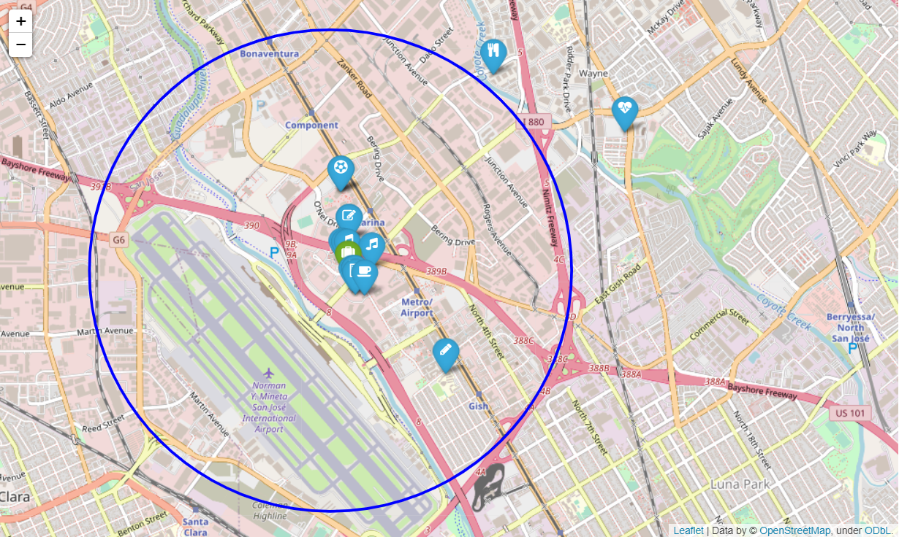

# Geospatial data project

For this project I used information about several companies and the Foursquare API to find the best localization for a company with diverse requisites.

## Importing the data

First of all, I created a new dtabase and a new collection on MongoDB, where I imported the data for this project. Then, I imported in jupyter notebook all the libraries needed and the client id and the token for the Foursquare API.

## First screening with MongoDB operator $near

Before doing the selection of the companies I created a new collection named "companies_unwinded", so that I didn't have several offices for the same company.

To select the companies that are located in Silicon Valley (California) I used the MongoDB operator $near. I chose this location as there are the big tech companies such as Google or Facebook. I also wanted that the company was near an airport so I looked for companies near the airport of San José. From this selection I obtained a list of companies where some of them were duplicated so I reduced the list to five companies to analyze them.

## Analysis of the offices' location

The order of the requisites I search for was the following:

1. Account managers need to travel a lot
2. Developers like to be near successful tech startups that have raised at least 1 Million dollars.
3. Designers like to go to design talks and share knowledge. There must be some nearby companies that also do design.
4. 30% of the company have at least 1 child.
5. All people in the company have between 25 and 40 years, give them some place to go to party.
6. The CEO is Vegan
7. If you want to make the maintenance guy happy, a basketball stadium must be around 10 Km.
8. Executives like Starbucks A LOT. Ensure there's a starbucks not to far.
9. The office dog "Pepe" needs a hairdresser every month. Ensure there's one not too far away. 

I searched for every company with the Foursquare API whether there were tech startups, design studios, elementary schools, nighlife spots, vegan restaurants, basketball courts, Starbucks and pet hairdressers near the different offices. 

## Visualization with folium

Once I got the data for every spot around the five different offices I was interested in, I visualized the points with folium to obtain maps with the localization of the company and the positions of interest.

## Difficulties encountered
I found difficult at the beginning stablishing the geoindex in MongoDB for the database and I couldn't import the functions from the file .py to the jupyter notebook where I was developing the project.
